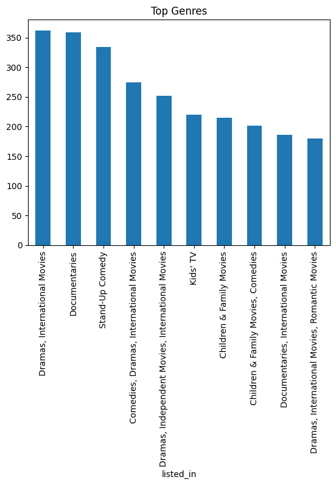

# Netflix Data Analysis

## Overview
This project analyzes Netflix's content dataset to uncover trends in movies and TV shows, including genres, release patterns, and content distribution.

## Objectives
- Analyze content distribution (Movies vs TV Shows)
- Identify most popular genres
- Study yearly release trends
- Explore country-wise content production

## Technologies Used
- Python
- Pandas
- NumPy
- Matplotlib / Seaborn
- Google Colab

## Dataset
Dataset sourced from Kaggle.

Download the dataset and place it in the `data/` folder before running the notebook.

## Project Structure
netflix-analysis/
│── data/
│── notebooks/
│── images/
│── README.md

## Key Insights
- Majority of content on Netflix consists of Movies
- Significant growth in content after 2015
- Drama and Comedy are among the most common genres
- USA produces the highest amount of content

## Visualizations
### Content Type Distribution

### Release Year Trend

### Top Genres

### Country-wise Content

## How to Run
1. Clone the repository
2. Install dependencies:
   pip install -r requirements.txt
3. Open notebook:
   notebooks/netflix_analysis.ipynb
